### <p align="center">`dsRNA_analyzer_2.py`</p>

*This script reads in a list of transcripts and evaluates their suitability as RNAi targets in a target organism. It will also search for off-targets in the target organism as well as potential hits in non-target organisms (NTOs).*

- dsRNA_analyzer_2 has been developed under the framework of the EU-funded project [**RATION**](https://www.ration-lrp.eu/).

- NOTE: Development of `dsRNA_analyzer_2.py` is based on `dsRNA_analyzer.v0.1.py`, created by Panos Ioannidis. `dsRNA_analyzer.v0.1.py` is available [here](https://gitlab.com/pioannidis/ration).


```
Usage: dsRNA_analyzer_2.py [-h] -i INPUT -o ORGANISM_DB -t TO -f TO_GENOME -n NTO -a NTO_GENOMES [-s SIRNA_LENGTH] [-d DSRNA_LENGTH] [-m MISMATCHES] [-p THREADS]

Options:
  -h, --help  show this help message and exit
  -p THREADS, --threads THREADS
            number of threads to use

required named arguments:
  -i INPUT, --input INPUT
			Path to input transcripts. This has to be a valid fasta/multi-fasta file
  -o ORGANISM_DB, --Organism_db ORGANISM_DB
            Mapping of organisms - one per line ID and scientific name, tab-separated
  -t TO, --TO TO        Target organism; Use scientific name
  -f TO_GENOME, --TO_genome TO_GENOME
            Path to target organism genome and GFF files
  -n NTO, --NTO NTO     List of NTO(s) considered in this run; Scientific names separated by semicolon(;)
  -a NTO_GENOMES, --NTO_genomes NTO_GENOMES
            Path to non-target organism genome(s)
  -s SIRNA_LENGTH, --siRNA_length SIRNA_LENGTH
            length of siRNA
  -d DSRNA_LENGTH, --dsRNA_length DSRNA_LENGTH
            length of dsRNA
  -m MISMATCHES, --mismatches MISMATCHES
            number of mismatches allowed when matching siRNAs to target and NTO genome
```
### 2. Dependencies ###
- [bowtie](https://bowtie-bio.sourceforge.net/index.shtml): fast, short DNA aligner.
- [NCBI datasets command line tool](https://www.ncbi.nlm.nih.gov/datasets/docs/v2/download-and-install/). Used to download genomes and GFF file.
- Python libaries:
  - `os`
  - `sys`
  - `argparse`
  - `re`
  - `pandas`
  - `subprocess`
  - `pysam`

### 3. Overview ###



### 4. Output ###
- Examples use transcripts from `Colorado potato beetle` [Leptinotarsa decemlineata] `psmb5` [XP_023014076.1] and `actin` [XP_023024442.1] genes.

#### 4.1. Output tables: ####
1. `siRNAs.all.tsv` tab delimited file with properties of all siRNA contained in each input transcript.

	| siRNA_name          | sequence             | QC_asymmetry | QC_nucleotide_runs | QC_GC_content | QC_specificity | QC_offtargets | QC_NTO_offtargets |
	|---------------------|----------------------|:------------:|:------------------:|:-------------:|:--------------:|:-------------:|:-----------------:|
	| XP_023014076.1_0    | ATGAGTTTAGCAGAGATCTG |       1      |          1         |       1       |        1       |       0       |         1         |
	| XP_023014076.1_1    | TGAGTTTAGCAGAGATCTGT |       0      |          1         |       1       |        1       |       1       |         1         |
	| …                   |                      |              |                    |               |                |               |                   |
	| XP_023014076.1_819  | TTGGAAAATACAATTGCTTA |       0      |          1         |       1       |        1       |       1       |         1         |
	| XP_023014076.1_820  | TGGAAAATACAATTGCTTAA |       0      |          1         |       1       |        1       |       1       |         1         |
	| XP_023024442.1_0    | ATGTGTGACGACGATGTAGC |       1      |          0         |       0       |        1       |       1       |         1         |
	| XP_023024442.1_1    | TGTGTGACGACGATGTAGCG |       1      |          0         |       0       |        1       |       0       |         1         |
	| …                   |                      |              |                    |               |                |               |                   |
	| XP_023024442.1_1110 | GTTCACCGCAAGTGCTTCTA |       0      |          0         |       0       |        1       |       0       |         1         |
	| XP_023024442.1_1111 | TTCACCGCAAGTGCTTCTAA |       0      |          0         |       1       |        1       |       1       |         1         |

	1. siRNA_name: name assigned to each siRNA; it's the name of the CDS with the suffix of the start position of this siRNA.
	sequence: sequence of the siRNA.
	2. QC_asymmetry: a binary flag (i.e. 0 or 1) indicating whether the particular siRNA is asymmetrical (it should have an A/T as its 5' nucleotide and a G/C as its 3' nucleotide).
	3. QC_nucleotide_runs: a binary flag indicating whether the siRNA contains nucleotide runs (at least 3 consecutive, identical nucleotides).
	4. QC_GC_content: a binary flag indicating whether the %GC of the siRNA is between 20-50%.
	5. QC_specificity: a binary flag indicating whether the siRNA has a bowtie hit within the genomic locus of the transcript.
	6. QC_offtargets: a binary flag indicating whether the siRNA has a bowtie hit outside of the genomic locus of the transcript.
	7. QC_NTO_offtargets: a binary flag indicating whether the siRNA has a bowtie hit in the genome of an NTO.

2. `[Gene]_NTO_hits.tsv` tab delimited file with NTO hits. Example data for `actin` [XP_023024442.1].

	| siRNA_name       | NTO_hit        | species                   | position | mismatched_bases | mismatches |
	|------------------|----------------|---------------------------|----------|------------------|:----------:|
	| XP_023024442.1_0 | NC_058195.1    | Coccinella septempunctata | 267059   | 2A17             |      1     |
	| XP_023024442.1_0 | NW_019091260.1 | Folsomia candida          | 174320   | 2A2T14           |      2     |
	| XP_023024442.1_0 | NW_019091199.1 | Folsomia candida          | 4109731  | 2A2T14           |      2     |
	| XP_023024442.1_0 | NT_037436.4    | Drosophila melanogaster   | 15504794 | 2C6C10           |      2     |
	| XP_023024442.1_0 | NC_058189.1    | Coccinella septempunctata | 16621784 | 17T2             |      1     |
	| XP_023024442.1_0 | NC_037642.1    | Apis mellifera            | 13147254 | 14A5             |      1     |
	| XP_023024442.1_0 | NW_019091196.1 | Folsomia candida          | 10638385 | 14A2T2           |      2     |
	| XP_023024442.1_0 | NW_019091196.1 | Folsomia candida          | 11546067 | 14A2T2           |      2     |
	| XP_023024442.1_0 | NW_019091195.1 | Folsomia candida          | 8051849  | 11T5T2           |      2     |
	| XP_023024442.1_0 | NC_037653.1    | Apis mellifera            | 1285007  | 5G5A8            |      2     |
	| XP_023024442.1_0 | NC_037642.1    | Apis mellifera            | 13152587 | 8T8T2            |      2     |
	| XP_023024442.1_1 | NC_058195.1    | Coccinella septempunctata | 267058   | 3A16             |      1     |
	| XP_023024442.1_1 | NC_063280.1    | Bombus terrestris         | 12635062 | 19A0             |      1     |
	| XP_023024442.1_1 | NC_058189.1    | Coccinella septempunctata | 16621785 | 16T3             |      1     |
	| ...              |                |                           |          |                  |            |

	1. siRNA_name: name assigned to each siRNA; it's the name of the CDS with the suffix of the start position of this siRNA.
	2. NTO_hit: Entrez ID of the hit on the NTO.
	3. species: NTO species name..
	4. position: position of NTO hit.
	5. mismatched_bases: SAM code produced by bowtie. For example, ‘2A17’ means perfect match for the first 2 bases, followed by a mismatch with A, then perfect match for the following 17 bases.
	6. mismatches: number of mismatches on NTO hit.

3. `dsRNAs_per_gene.tsv` Suggested dsRNAs based on correpsonding value in the input. Example assumes dsRNA of 500nt.

	| TranscriptID   | best_dsRNA_start | best_dsRNA_stop | Transcript_length | siRNAs_specific_to_target_gene | siRNAs_targeting_NTOs | dsRNA_sequence                       |
	|----------------|:----------------:|:---------------:|:-----------------:|:------------------------------:|:---------------------:|--------------------------------------|
	| XP_023014076.1 |        291       |       791       |        840        |                3               |           11          | ACCATGAAAAAAATTGTGGAAATCAATGATTTC... |
	| XP_023024442.1 |         0        |       500       |        1131       |                1               |           11          | ATGTGTGACGACGATGTAGCGGCTCTTGTCG...   |

	1. TranscriptID: transcript ID.
	2. best_dsRNA_start: the starting position of the suggested dsRNA (500-nt in this example).
	3. best_dsRNA_stop: the stopping position of the dsRNA.
	4. Transcript_length: the total length of the transcript so that one can tell if the dsRNA falls towards the 5' or 3' of the transcript.
	5. siRNAs_specific_to_target_gene: siRNAs without off-target hits in target organism.
	6. siRNAs_targeting NTOs: siRNAs targeting non- target organisms.
	7. dsRNA_sequence: the sequence of the dsRNA. If the transcript length is smaller than the one specified on the command line  then no dsRNA will be suggested.

- In addition to the three tables above, a multi-fasta file containing all generated siRNAs and a subset of `siRNAs.all.tsv` containing only the siRNAs that have passedall tests (`siRNAs.good.tsv`), are provided for convenience.

### 5. How to prepare input data and run the script ###

1. Create directories to hold the target organism (**TO**) and non-target organisms (**NTO**) genomic data. 
2. Obtain the **target organism (TO)** genome and GFF (annotation) files.
   
   a. Download files from [NCBI Datasets](https://www.ncbi.nlm.nih.gov/datasets/) into the **TO directory**. For example, for `Leptinotarsa decemlineata` do the following:

		datasets download genome accession GCF_000500325.1 --include gff3,cds,protein,genome,seq-report

   b. Unzip the downloaded file and create symbolic links to the **genome** and **GFF**, while at the same time simplifying names, eg:
    
		ln -s ncbi_dataset/data/GCF_000500325.1_Ldec_2.0_genomic.fna GCF_000500325.1.fna
		
		and
	
		ln -s ncbi_dataset/data/genomic.gff GCF_000500325.1.gff
	
	**Make sure to follow the above naming conventions and that the "base" names (eg GCF_000500325.1) for the .fna and .gff files are the same**.
   
   c. Build a `bowtie index` of the TO genome:
    
		bowtie-build --threads 8 -f GCF_000500325.1.fna GCF_000500325.1_bowtie_idx
	
	Make sure to adhere to the above naming convention, keeping the suffix *_bowtie_idx* at the end of the index file.

3. Obtain the **non-target organism (NTO)** genomes.
  
	a. Download files from [NCBI Datasets](https://www.ncbi.nlm.nih.gov/datasets/) into the **NTO directory**. For example, for `Apis mellifera (honey bee)` do the following:
  
		datasets download genome accession GCF_003254395.2 --include genome
  
	b. Unzip the downloaded file and create symbolic links to the **genome** .fna file, while at the same time simplifying names, eg:
    
		ln -s ncbi_dataset/data/GCF_003254395.2_Amel_HAv3.1_genomic.fna GCF_003254395.2.fna

	c. Create `bowtie index` for each of the NTO genomes:

		bowtie-build --threads 8 -f GCF_003254395.2.fna GCF_003254395.2_bowtie_idx

	**Again, make sure to adhere to naming conventions as per the TO instructions**.

4. Obtain IDs from FASTA headers of NTO genome files. These will be used to identify genes targeted by siRNAs in NTOs:

		grep -P '^>' GCF_003254395.2.fna | perl -pe 's/>([^ ]+) ([^ ]+) ([^ ]+) .+$/\1\t\2 \3/' > GCF_003254395.2.fna.ids

5. Create a master tab-delimited file with all organisms, both TO and NTOs mapping `RefSeq/GenBank assembly IDs` to `scientific names`. The structure should be as follows (with examples; lines starting with "#" are optional):

	| #TO                  | Scientific name           | Common name            | GFF file            |
	|----------------------|---------------------------|------------------------|---------------------|
	| GCF_000500325.1.fna  | Leptinotarsa_decemlineata | Colorado potato beetle | GCF_000500325.1.gff |
	| #NTO                 |                           |                        |                     |
	| GCF_000001215.4.fna  | Drosophila melanogaster   |                        |                     |
	| GCF_000001405.40.fna | Homo sapiens              | human                  |                     |
	| GCF_002217175.1.fna  | Folsomia candida          | springtail             |                     |
	| GCF_003254395.2.fna  | Apis mellifera            | honey bee              |                     |
	| GCF_907165205.1.fna  | Coccinella septempunctata | ladybug                |                     |
	| GCF_910591885.1.fna  | Bombus terrestris         | bumblebee              |                     |

6. Run the script per the following example. Input transcripts are `Leptinotarsa decemlineata` `psmb5` [XP_023014076.1] and `actin` [XP_023024442.1] in a multi-fasta file:
    
	```
	python dsRNA_analyzer_2.py \
	-i Ldec_psmb5_actin.fa \
	-o [Path to master file with all organisms] \
	-t "Leptinotarsa_decemlineata" \
	-f [Path to target organism genome and GFF files] \
	-n "Drosophila melanogaster;Folsomia candida; Apis mellifera" \
	-a [Path to NTO genomes] \
	-s 20 \
	-d 500 \
	-m 2
   ```
